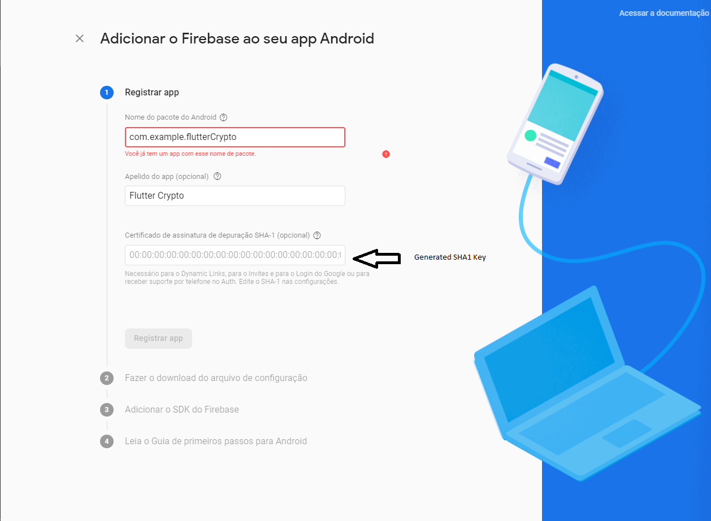

# Flutter Crypto
### Flutter Crypto and Wallet Template with Firebase and Crypto API
    
Flutter Crypto contains 30+ Animated Screens, Firebase auth, crypto market live price, dark and light mode, multi-languages and UI animations. This kit can save your time to code all Front end layout and its Easy to implement with your back end. One the main thing is Its support both platforms Android and ios.


## Features:

  - Multi Languages (English, Portuguese, French, German, Greek, Spanish) updated dynamically by the system Language
  - Light and Dark Theme, updated automatically by the mobile theme or pre-selected  
  - CoinMarketCap API
  - Firebase, Google, Facebook and Twitter  Auth  
  - Send Reset Password Email 
  - Anonymous Auth  
  - Loader Animation
  - Login and Register Pages
  - Responsive Design to any all device screen
  - Preloader With Flare animations 
  - Simple Linear Chart Graph 
  - Store theme change locally
  

## Requirements:
### Flutter Environment
* Flutter SDK
* Android SDK or IOS
* Code Editor (preferred&nbsp;Visual Studio Code)
* Firebase database Credentials 
* Facebook API Key
* Twitter API Key
* CoinMarketCap API Key

 

## Instructions
### Steps to start using this template

Unzip the folder
Run this command
```sh
$ cd *folder name* 
$ flutter pub get
```

## Getting Started
### Firebase Authentication
Create your own project in [Firebase Console ](https://console.firebase.google.com/). 	

Inside your Project  Create an Android App and Ios App
 Android App:

 1. Press Create Android App;
 2. [Create sha1 key for google authentication](https://developers.google.com/android/guides/client-auth);
 3. Insert the values:
  
 4. Download this file to **project folder**/android/app/
   
  5. Then skip all by pressing next;

IOS App:

1. Press Create IOS App;
2. Insert the Values:
 
 3. Download this file to **project folder**/ios/Runner/
 

### Activate Services:

#### Facebook:

Helpful video [Set facebook auth example](https://www.youtube.com/watch?v=r0JtCUkSdWQ) (12:14-26:40)

#### Twitter:

1. Go to twitter developer website and apply for a [developer account](https://developer.twitter.com/en/apply-for-access);
2. When you have finished creating the project in twitter dev account active "Authentication settings":
- CallBack URLS: 
		
		https://<YOUR FIREBASE PROJECT NAME>.firebaseapp.com/__/auth/handler
		twittersdk://
		twitterkit-<YOUR API KEY>:// 
		
- Website,  Terms of Service, Privacy Policy:
			 
			 https://<YOUR FIREBASE PROJECT NAME>.firebaseapp.com/__/auth/handler

3. Open firebase console and active twitter sign-in method;
4. You will have the Key and Secret key in the twitter dev dashboard;

5. In **project folder**/ios/Runner/Info.plist line 51 change twitterkit-*YOUR TWITTER API KEY*
6. In  **project folder**/lib/services/Keys.dart change:
```sh
class  Keys {
...
final twitterSecret =  "<Your Twitter Consumer Secret Key>";

final twitterPublic =  "<Your Twitter Consumer Key>";
...
}
```

Helpful video [Set twitter auth example](https://www.youtube.com/watch?v=AmezHgR9Adc&t=129s) (2:15-end)

1. In your Firebase Controller go to "Authentication"->"Sign-in method"	
2. Active The Providers "E-mail/Password", "Google".


####  CoinMarketCap

To the live market price work you need a [CoinMarketCap API Key](https://pro.coinmarketcap.com/account).
1. Sign up and get the api key on your account dashboard.
2. In **project folder**/lib/services/Keys.dart change:

```sh
class  Keys {
...
final coinMarketCapKey =  "<Your CoinMarketCap Key>";


}
```


## Aditional 
### Add More Languages to the App

Create a .json file inside the lang folder with the Country Language Code.

### Example: 
#### File Name:

#### File data:
 Copy the parameters and change each value to the Text you want to translate.
 


#### In code

 1. Add the country language code in the model/Languages.dart  file on the supportedLocales parameter.


 
 2. Add the country language code in the utils/AppLocalizations.dart on isSupported function.


Now When the device its in the new language the application will translate all the text.

### Change Loader animation

[More Loading Examples](https://pub.dev/packages/flutter_spinkit#-showcase)
To change the loader the only thing you have to do is change the widget "SpinKitWave" in **project folder**/lib/utils/animations/Loading.dart to the widget name you have chosen. 

#### Example:
I want the "Circle" animation what I need to do its change "SpinKitWave" to "SpinKitCircle".

### App Colors
All the app colors are in the **project folder**/lib/utils/theme/AppTheme.dart

The light and dark theme colors are set in this two lists:   

### Add more Routes to the bottom navigation bar
Go to **project folder**/lib/route/TabNavigator.dart 	and add or replace this with your named route:
```sh
switch (tabItem) {
.....
	case  'NAME OF ROOT YOU WANT TO ADD':
		child =  CHILD YOU WANT TO SHOW;
		break;
.....
```
Then go to **project folder**/lib/model/MenuItems.dart and inside the menuitems List add the icon:
```sh
List<BottomNavigationBarItem> menuitems = [
.....
BottomNavigationBarItem(

	label:  'NAME OF ROOT YOU WANT TO ADD',

	icon:   'BOTTOM NAVIGATION ICON',
),
.....
```

### Graph Changes
If you want to make any changes to the graph you can see the docs [here](https://github.com/imaNNeoFighT/fl_chart/blob/master/repo_files/documentations/line_chart.md).


### Contact 
Email: ricardosf195@gmail.com 